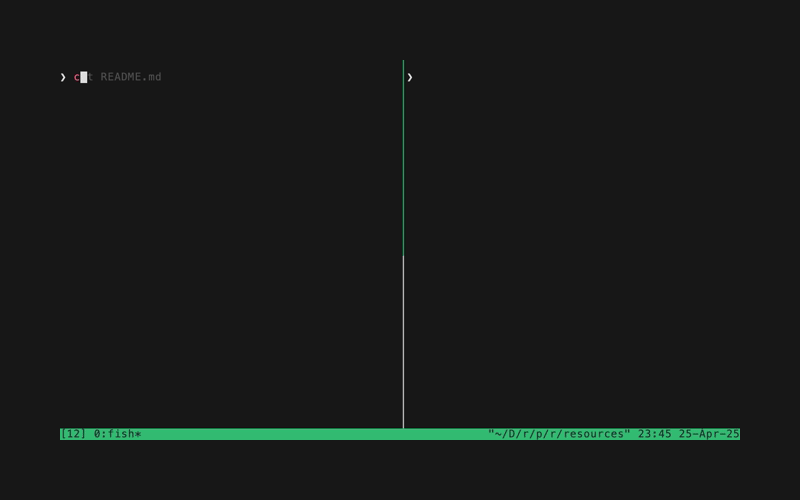

# rr - readme runner

`rr` is a lightweight task runner that treats your project's `README.md` as the source of truth for executable tasks.  
It discovers and executes bash/sh code blocks by index or label.

## Alternatives

The best known alternatives are [maid](https://github.com/egoist/maid) and [xc](https://github.com/joerdav/xc).  
`rr` is intended to be portable without any dependencies (bash script only).  
Works immediately with existing README files without any modifications.

