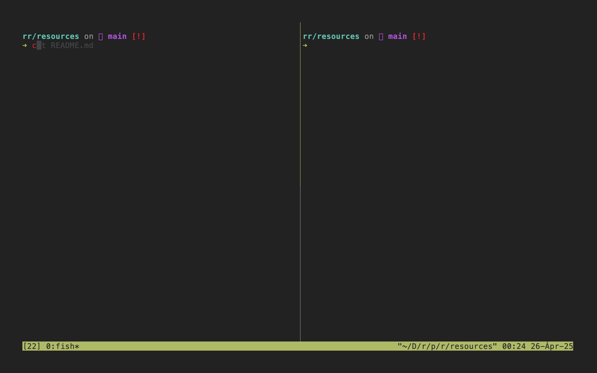

# rr - readme runner

`rr` is a lightweight task runner that treats your project's `README.md` as the source of truth for executable tasks.  
It discovers and executes bash/sh code blocks by index or label.



## Configuration

By default, `rr` scans `README.md`. To target a different file, set the `RR_FILE` environment variable:

```bash
export RR_FILE="docs/tasks.md"
```